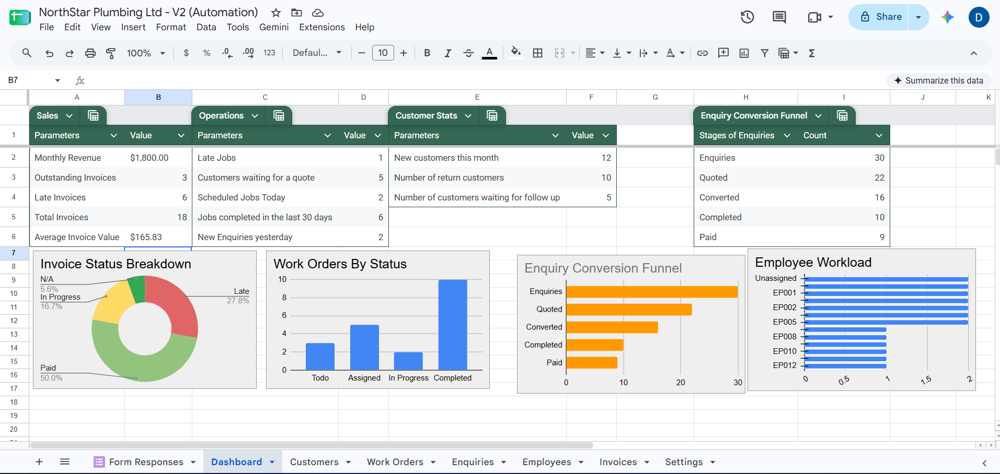

# NorthStar Plumbing — Service Operations Automation

An end-to-end business process automation system designed for a fictional plumbing company, automating the customer journey from initial enquiry through technician scheduling, customer communication, invoice tracking, and operational reporting.

## Project Overview

NorthStar Plumbing is a fictional service business I created to explore how workflow automation can reduce repetitive administrative work in a field-service environment.

The system automates key stages of the customer service lifecycle, including customer and enquiry management, AI-assisted enquiry processing, work order creation, technician scheduling, customer communication, and operational reporting.

## Business Problem

A small field-service business may rely on staff to manually:

- Record customer enquiries
- Check whether a customer already exists
- Create and update customer records
- Convert approved enquiries into work orders
- Assign technicians
- Schedule appointments
- Send appointment confirmations
- Track invoices and payments
- Monitor outstanding work and operational performance

Handling these processes manually across separate systems creates repetitive administrative work and increases the risk of duplicate records, missed follow-ups, scheduling errors, and inconsistent data.

## Solution

I designed an automated service operations system using Make.com as the workflow orchestration layer, with Google Sheets acting as the central operational data store.

The solution connects customer intake, enquiry management, work order creation, technician scheduling, customer communication, invoice tracking, and reporting.

Key parts of the solution include:

- Identifying whether an enquiry comes from a new or existing customer
- Automatically creating and updating customer and enquiry records
- Generating unique IDs to maintain relationships between records
- Converting approved enquiries into work orders
- Assigning technicians and tracking employee availability
- Creating scheduled appointments in Google Calendar
- Sending automated appointment confirmations through Gmail
- Preventing duplicate work orders by only processing accepted enquiries without an existing Work Order ID
- Tracking job progress, customer follow-ups, and invoice status
- Surfacing operational KPIs through a live dashboard

## System Architecture

The system uses Make.com to coordinate data and actions between the different components of the workflow.

**Core technologies:**

- **Make.com** — workflow orchestration and automation logic
- **Google Sheets** — operational data storage and reporting
- **Google Forms** — customer enquiry capture
- **Google Calendar** — appointment scheduling
- **Gmail** — automated customer communication
- **Google Gemini** — AI-assisted enquiry processing

### Architecture Overview

## Automation Workflows

The system is divided into five Make.com scenarios, with each scenario responsible for a specific stage of the service lifecycle.

### 1. Customer & Enquiry Intake

Customer enquiries are submitted through Google Forms and processed automatically.

The workflow:

1. Captures the customer's form submission.
2. Searches existing customer records to determine whether the customer already exists.
3. Generates a unique Enquiry ID.
4. Routes the workflow based on whether the customer is new or returning.
5. Creates a new customer record when required.
6. Creates the enquiry and links it to the relevant Customer ID.

This avoids creating duplicate customer records while maintaining a consistent relationship between customers and their enquiries.

#### Make.com Scenario

### 2. AI Enquiry Processing

New enquiries can be enriched using Google Gemini.

The workflow identifies enquiries requiring AI processing, sends the enquiry information to Gemini, and stores the generated output against the relevant enquiry record.

This demonstrates how an LLM can be incorporated into an operational workflow rather than used as a standalone chatbot.

#### Make.com Scenario

### 3. Work Order Creation

Accepted enquiries are converted into operational work orders.

The workflow:

1. Identifies accepted enquiries.
2. Generates a unique Work Order ID.
3. Retrieves the associated customer information.
4. Creates a work order linked to the customer and enquiry.
5. Updates the original enquiry with its Work Order ID.

This maintains traceability between the original customer request and the resulting job.

#### Make.com Scenario

### 4. Technician Scheduling & Customer Communication

Once a work order has been assigned, the scheduling workflow coordinates the job across multiple applications.

The workflow:

1. Identifies assigned work orders that have not yet been added to the calendar.
2. Retrieves the assigned employee.
3. Updates the employee's availability status to Busy.
4. Creates the appointment in Google Calendar.
5. Stores the Calendar Event ID against the work order.
6. Retrieves the associated customer information.
7. Sends an automated confirmation email through Gmail.
8. Records that the confirmation email has been sent.

This scenario connects operational data, employee availability, scheduling, and customer communication in a single workflow.

#### Make.com Scenario

### 5. Work Order Completion

Completed jobs trigger a final workflow that closes the operational lifecycle.

The workflow records the work order completion date, identifies the employee who completed the job, and changes their availability back to Available.

This ensures employee availability remains synchronised with job status.

#### Make.com Scenario

## Dashboard & Reporting

Operational data generated by the workflows is consolidated in Google Sheets and surfaced through a live reporting dashboard.

The dashboard provides an overview of business performance and outstanding operational work without requiring users to manually review individual customer, enquiry, work order, and invoice records.

### Key Metrics

The dashboard tracks:

- Monthly revenue
- Total, outstanding, and overdue invoices
- Average invoice value
- Scheduled jobs
- Recently completed jobs
- Overdue jobs
- New enquiries and customers
- Customers awaiting quotes or follow-up
- Returning customers

### Service Funnel

A service funnel provides visibility across the customer journey:

**Enquiries → Quoted → Converted → Completed → Paid**

This makes it possible to see how customer enquiries progress through the operational workflow and identify where work may be dropping off or becoming delayed.

### Dynamic Reporting

Dashboard metrics are calculated from the underlying operational tables, allowing reporting to update as customer, enquiry, work order, and invoice records change.

### Operational Dashboard

## Technical Challenges & Design Decisions

Building the system required handling several issues that arise when automating processes across multiple workflows and data tables.

### Maintaining Relationships Between Records

Customer enquiries, work orders, employees, and invoices are stored as separate records but need to remain connected throughout the service lifecycle.

I implemented unique identifiers such as Customer IDs, Enquiry IDs, and Work Order IDs and passed these between workflows. This allows records to be retrieved and updated without relying on names or other potentially duplicated information.

For example, when an accepted enquiry becomes a work order, the resulting Work Order ID is written back to the original enquiry to maintain traceability between the two records.

### Handling New and Existing Customers

An enquiry may come from either a new customer or someone already stored in the system.

Before creating a customer record, the intake workflow searches the existing customer data. A router then sends the enquiry through different paths depending on whether a matching customer was found.

Existing customers are linked to their current Customer ID, while new customers receive a new customer record and unique ID before their enquiry is created.

This prevents unnecessary duplicate customer records while allowing both cases to be handled through the same intake process.

### Preventing Repeated Automation Actions

Scheduled scenarios can encounter the same records across multiple executions, creating a risk that actions such as work order creation, calendar scheduling, or customer emails could be performed more than once.

To address this, workflow state is stored against the relevant operational records. For example, generated Work Order IDs, Calendar Event IDs, and confirmation status fields can be used to determine whether an action has already occurred before processing the record again.

This makes the workflows safer to run repeatedly without intentionally recreating completed actions.

### Synchronising Technician Availability

Technician availability needs to remain consistent with the work being scheduled.

When a work order is scheduled, the assigned employee's status is changed to Busy before the appointment is added to Google Calendar. When the work order is completed, a separate workflow returns the employee's status to Available.

Separating completion into its own workflow allows employee availability to remain synchronised with the operational status of jobs.

### Designing for Traceability

Rather than treating each automation as an isolated workflow, I designed the scenarios to update the underlying operational records as they progress.

Information such as Work Order IDs, Calendar Event IDs, email confirmation status, completion dates, and activity records provides visibility into what actions have already occurred.

This makes the system easier to monitor, troubleshoot, and extend as additional workflows are introduced.

## Technologies Used

| Technology | Purpose |
|---|---|
| Make.com | Workflow orchestration, routing, data transformation, and cross-application automation |
| Google Sheets | Operational data storage, record management, and dashboard reporting |
| Google Forms | Customer enquiry capture |
| Google Gemini | AI-assisted enquiry processing |
| Google Calendar | Technician appointment scheduling |
| Gmail | Automated customer appointment confirmations |

## What I Learned

This project gave me practical experience designing an automation around a complete business process rather than an isolated task.

Key areas I developed included:

- Breaking a business process into separate, connected automation workflows
- Designing relationships between customers, enquiries, work orders, employees, and invoices
- Using routers, filters, searches, and conditional logic to control workflow behaviour
- Maintaining state between separate automation runs
- Integrating multiple applications into a single operational process
- Incorporating an LLM into an existing business workflow
- Designing workflows to safely handle repeated execution and maintain traceability
- Building operational reporting on top of the data generated by automated processes

The project also reinforced the importance of designing the underlying data structure before adding automation. Reliable IDs, statuses, and relationships between records made it significantly easier to connect the individual workflows into a larger system.

## Future Improvements

If the system were developed further, potential improvements would include:

- Replacing Google Sheets with a dedicated relational database as data volume and complexity increase
- Adding stronger error handling, retries, and automated failure notifications
- Introducing more advanced technician assignment based on availability, workload, location, and job requirements
- Expanding the AI processing layer to extract and structure additional information from customer enquiries
- Adding automated invoice generation and payment reminders
- Creating role-based interfaces for administrative staff and technicians
- Adding more detailed workflow monitoring and audit logging
- Moving selected integrations to API- or webhook-driven processing where real-time execution would provide a benefit

## Demo Workbook

A demonstration workbook containing fictional sample data is included in this repository to show the underlying data structure and reporting model used by the automation.

> **Note:** All records in the workbook are fictional demo data created to demonstrate the system. The workbook does not contain real customer information.
