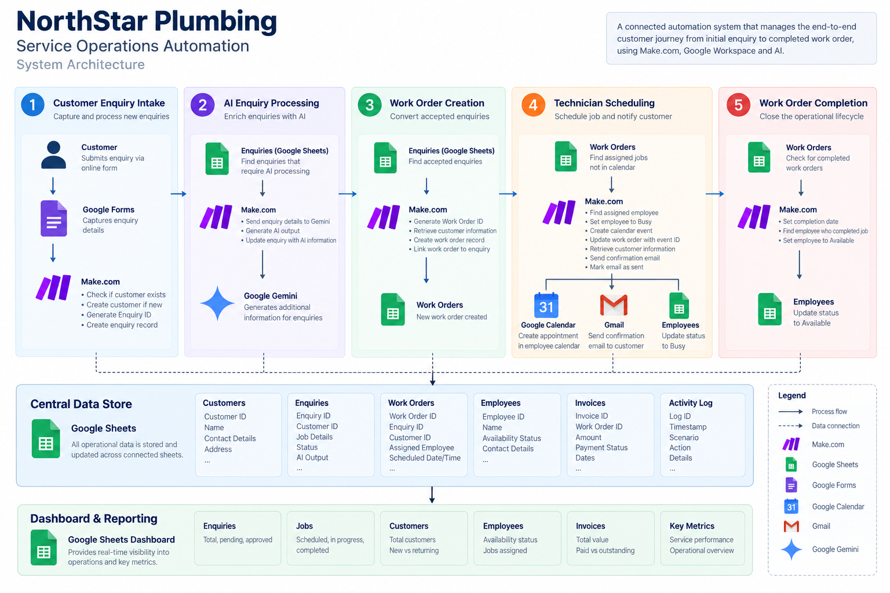
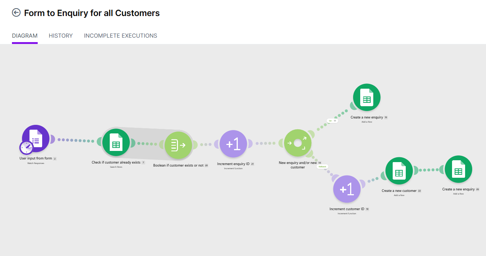
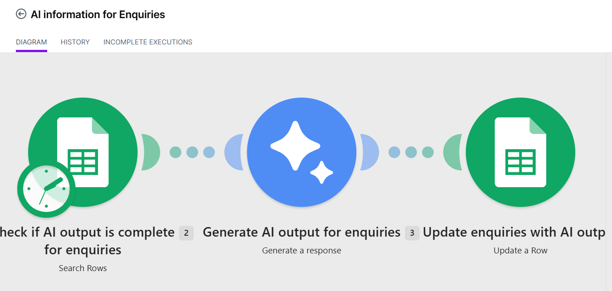
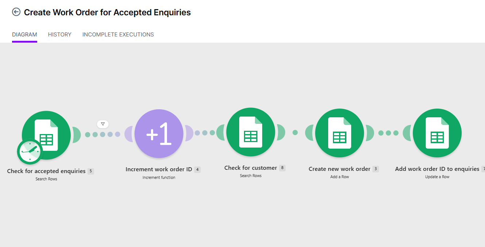
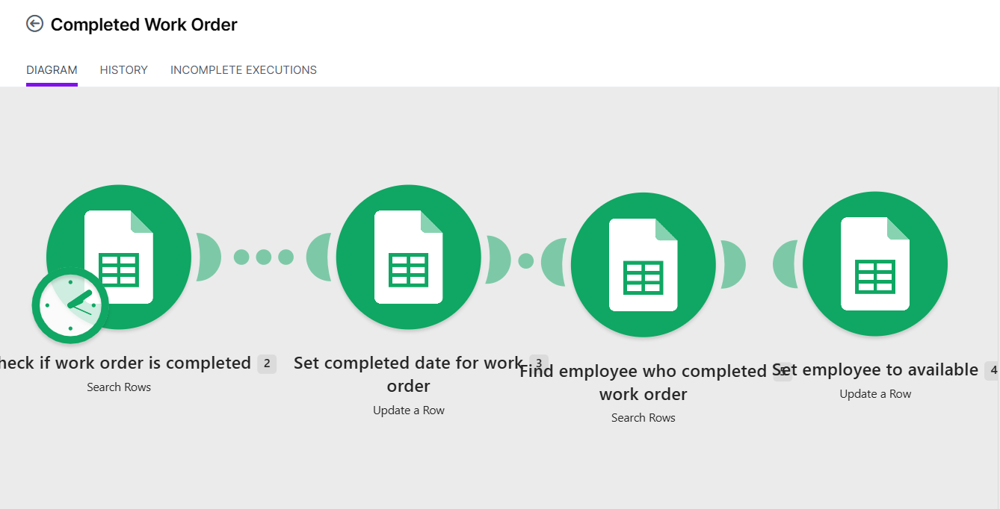
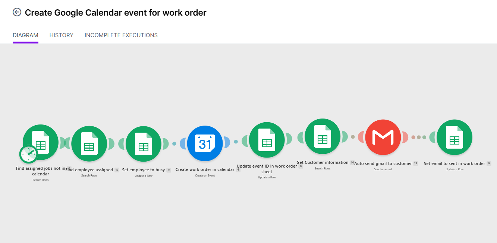

# NorthStar Plumbing — Service Operations Automation

An end-to-end business process automation system designed for a fictional plumbing company, automating the customer journey from initial enquiry through work order creation, technician scheduling, customer communication, invoicing, and operational reporting.

## Project Overview

NorthStar Plumbing is a fictional service business I created to explore how workflow automation can reduce repetitive administrative work in a field-service environment.

The system connects multiple stages of the service process into an automated workflow. Customer enquiries are captured and matched against existing customer records, work orders can be generated from approved enquiries, technicians can be assigned based on availability, appointments can be added to Google Calendar, and customers receive automated email confirmations.

Operational data is stored centrally and surfaced through a dashboard that provides visibility into enquiries, jobs, customers, and invoices.

## Business Problem

A small field-service business may rely on staff to manually:

- Record customer enquiries
- Check whether a customer already exists
- Create and update customer records
- Convert approved enquiries into work orders
- Assign technicians
- Schedule appointments
- Send appointment confirmations
- Track invoices and payments
- Monitor outstanding work and operational performance

Handling these processes manually across separate systems creates repetitive administrative work and increases the risk of duplicate records, missed follow-ups, scheduling errors, and inconsistent data.

## Solution

I designed an automated service operations system using Make.com as the workflow orchestration layer, with Google Sheets acting as the central operational data store.

The solution connects customer intake, enquiry management, work order creation, technician scheduling, customer communication, invoicing, and reporting.

Key parts of the solution include:

- Identifying whether an enquiry comes from a new or existing customer
- Automatically creating and updating customer and enquiry records
- Generating unique IDs to maintain relationships between records
- Converting approved enquiries into work orders
- Assigning technicians and tracking employee availability
- Creating scheduled appointments in Google Calendar
- Sending automated appointment confirmations through Gmail
- Preventing duplicate work orders by only processing accepted enquiries without an existing Work Order ID
- Maintaining an activity log to provide visibility into workflow actions
- Tracking invoices, job progress, and customer follow-ups
- Surfacing operational KPIs through a live dashboard

## System Architecture

The system uses Make.com to coordinate data and actions between the different components of the workflow.

**Core technologies:**

- **Make.com** — workflow orchestration and automation logic
- **Google Sheets** — operational data storage and reporting
- **Google Forms** — customer enquiry capture
- **Google Calendar** — appointment scheduling
- **Gmail** — automated customer communication
- **Google Gemini** — AI-assisted enquiry processing

### Architecture Overview

## Automation Workflows

The system is divided into five Make.com scenarios, with each scenario responsible for a specific stage of the service lifecycle.

### 1. Customer & Enquiry Intake

Customer enquiries are submitted through Google Forms and processed automatically.

The workflow:

1. Captures the customer's form submission.
2. Searches existing customer records to determine whether the customer already exists.
3. Generates a unique Enquiry ID.
4. Routes the workflow based on whether the customer is new or returning.
5. Creates a new customer record when required.
6. Creates the enquiry and links it to the relevant Customer ID.

This avoids creating duplicate customer records while maintaining a consistent relationship between customers and their enquiries.

#### Make.com Scenario

### 2. AI Enquiry Processing

New enquiries can be enriched using Google Gemini.

The workflow identifies enquiries requiring AI processing, sends the enquiry information to Gemini, and stores the generated output against the relevant enquiry record.

This demonstrates how an LLM can be incorporated into an operational workflow rather than used as a standalone chatbot.

#### Make.com Scenario

### 3. Work Order Creation

Accepted enquiries are converted into operational work orders.

The workflow:

1. Identifies accepted enquiries.
2. Generates a unique Work Order ID.
3. Retrieves the associated customer information.
4. Creates a work order linked to the customer and enquiry.
5. Updates the original enquiry with its Work Order ID.

This maintains traceability between the original customer request and the resulting job.

#### Make.com Scenario

### 4. Technician Scheduling & Customer Communication

Once a work order has been assigned, the scheduling workflow coordinates the job across multiple applications.

The workflow:

1. Identifies assigned work orders that have not yet been added to the calendar.
2. Retrieves the assigned employee.
3. Updates the employee's availability status to Busy.
4. Creates the appointment in Google Calendar.
5. Stores the Calendar Event ID against the work order.
6. Retrieves the associated customer information.
7. Sends an automated confirmation email through Gmail.
8. Records that the confirmation email has been sent.

This scenario connects operational data, employee availability, scheduling, and customer communication in a single workflow.

#### Make.com Scenario

### 5. Work Order Completion

Completed jobs trigger a final workflow that closes the operational lifecycle.

The workflow records the work order completion date, identifies the employee who completed the job, and changes their availability back to Available.

This ensures employee availability remains synchronised with job status.

#### Make.com Scenario

## Dashboard & Reporting

Operational data generated by the workflows is consolidated in Google Sheets and surfaced through a live reporting dashboard.

The dashboard provides an overview of business performance and outstanding operational work without requiring users to manually review individual customer, enquiry, work order, and invoice records.

### Key Metrics

The dashboard tracks:

- Monthly revenue
- Total, outstanding, and overdue invoices
- Average invoice value
- Scheduled jobs
- Recently completed jobs
- Overdue jobs
- New enquiries and customers
- Customers awaiting quotes or follow-up
- Returning customers

### Service Funnel

A service funnel provides visibility across the customer journey:

**Enquiries → Quoted → Converted → Completed → Paid**

This makes it possible to see how customer enquiries progress through the operational workflow and identify where work may be dropping off or becoming delayed.

### Dynamic Reporting

Dashboard metrics are calculated from the underlying operational tables, allowing reporting to update as customer, enquiry, work order, and invoice records change.
